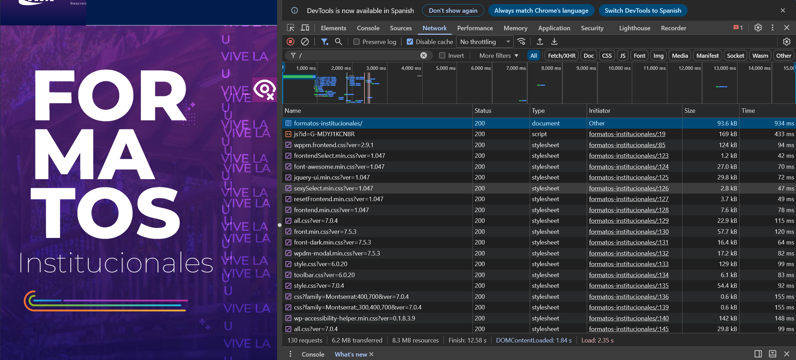
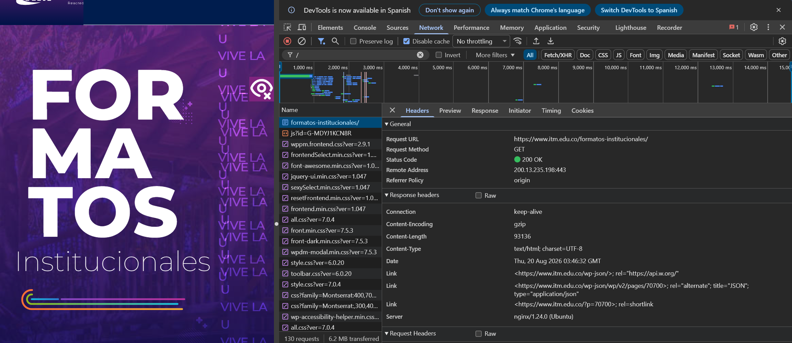
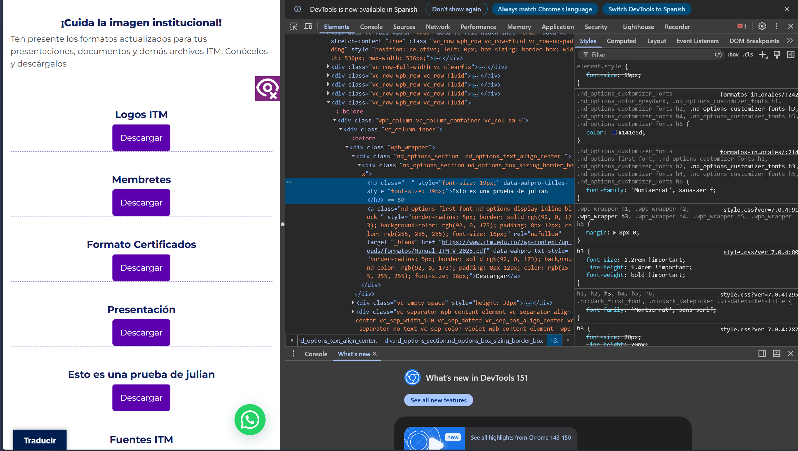
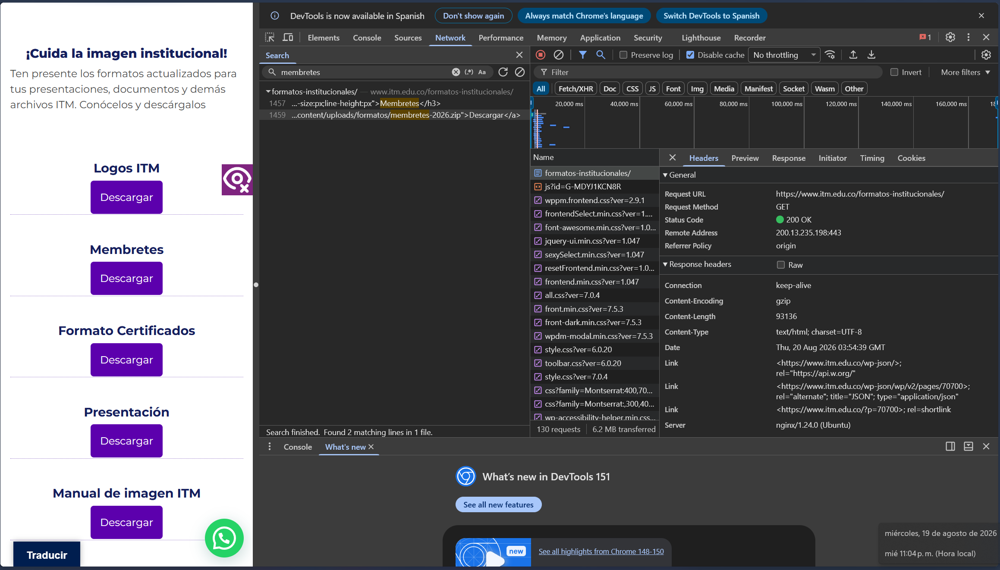

Aquí tienes el código en Markdown listo para copiar y pegar directamente dentro de tu archivo `README.md` en VS Code:

```markdown
# Laboratorio 01: Análisis de página web

**Estudiante:** Daniel Calle  
**Materia:** Aplicaciones y Servicios Web  
**Página que revisé:** [itm.edu.co/formatos-institucionales](https://www.itm.edu.co/formatos-institucionales/)  
**Entrega:** Rama `clase3`  

---

## 1. Preparación de las herramientas
Para este trabajo me metí a la página del ITM desde Chrome y le di a la tecla `F12` para sacar las herramientas de inspección. Me concentré más que todo en la pestaña **Network** (para ver las cosas que carga la página) y en **Elements** (para mirar el código HTML y hacer una prueba cambiando texto).

Así organizó los archivos en la carpeta de mi computador:

```text
Aplicaciones-y-servicios-web/
└── laboratorio-01/
    ├── README.md
    └── evidencias/
        ├── network.png
        ├── request.png
        ├── dom.png
        └── interaccion.png

```

## 2. Los recursos que cargó la página


Le di a la opción de deshabilitar la caché y recargué la página. En total me mostró que hizo 130 peticiones, pesó más o menos 6.2 MB y se demoró casi 12.5 segundos en cargar del todo.



Aquí puse 5 archivos de los que me salieron en la lista:

| Archivo / Recurso | Tipo de archivo | De dónde viene | Peso |
| --- | --- | --- | --- |
| `formatos-institucionales/` | Documento (HTML) | `www.itm.edu.co` | 93.6 KB |
| `js?id=G-MDYJ1KCN8R` | Script (JS) | `googletagmanager.com` | 169 KB |
| `wppm.frontend.css?ver=2.9.1` | Estilos (CSS) | `www.itm.edu.co` | 124 KB |
| `font-awesome.min.css?ver=1.0.47` | Estilos (CSS) | `www.itm.edu.co` | 27.0 KB |
| `css?family=Montserrat:400,700` | Letra / Fuente | `fonts.googleapis.com` | 0.6 KB |

> **¿Por qué hace tantas llamadas la página para una sola URL?**
> Porque la página no es un solo pedazo. Primero baja la estructura principal y de ahí el navegador va pidiendo por separado las imágenes, los estilos de diseño, los tipos de letra y las funciones de JavaScript.

## 3. Revisando una petición

Escogí la primera petición que hace el navegador al entrar al enlace (`formatos-institucionales/`).



| Datos | Lo que salió |
| --- | --- |
| **URL** | `https://www.itm.edu.co/formatos-institucionales/` |
| **Método** | `GET` |
| **Estado** | `200 OK` |
| **Dirección IP** | `200.13.235.198:443` |
| **Tipo de contenido** | `text/html; charset=UTF-8` |
| **Servidor** | `nginx/1.24.0 (Ubuntu)` |

> **¿Qué archivo se pidió y cómo se sabe si respondió bien?**
> Se pidió el documento HTML de la página. Sé que respondió bien porque dio la respuesta 200 OK, lo que significa que el servidor encontró la información y la mandó sin problemas.

## 4. Probando la pestaña Elements (DOM)

En la pestaña Elements busqué un título `<h3>` que decía "Fuentes ITM".

Le di doble clic para editarlo ahí mismo en la consola de Chrome y le escribí "Prueba de Daniel". Apenas le di enter, el texto cambió en la pantalla.



¿El cambio se guarda para los demás usuarios?

No, eso solo cambia en la pantalla de mi computador porque estoy editando lo que el navegador ya descargó. Si le doy actualizar a la página, se vuelve a traer la información original del servidor y el texto que puse se borra.

## 5. Dándole clic a un botón

Hice la prueba dando clic en el botón para bajar el archivo comprimido de los membretes y miré qué pasaba en la pestaña Network.



**Lo que hice:** Clic en "Descargar" en la parte de Membretes.

**Lo que pasó en red:** El navegador mandó una orden para descargar el archivo `.zip` alojado en la carpeta del sitio.

**Método y Estado:** Fue un método GET y sacó código 200 OK.

Al darle al botón, la página hace la solicitud directa para bajar el archivo sin tener que cargar toda la página web desde cero otra vez.

## 6. Esquema del proceso

Así es básicamente cómo se comunican mi navegador y el servidor:

```text
[ Mi Navegador ]
      │
      ├── (1) Pide entrar a la página (GET) ────────────> [ Servidor del ITM ]
      │<── (2) Devuelve el HTML principal (200 OK) ─────────┤
      │
      ├── (3) Pide estilos, tipografías y scripts ────────> [ Servidores de archivos ]
      │<── (4) Manda todos los archivos ───────────────────┤
      │
      ├── (5) Clic en el botón de bajar membretes ────────> [ Guardado de archivos ]
      └── (6) Empieza a descargar el paquete .zip ─────────┘

```

## 7. Lo que vi vs. Lo que deduje

**Lo que vi directamente:**

* Vi la IP `200.13.235.198`.
* Vi que en total la pestaña Network marcó 130 peticiones.
* Vi que al cambiar la etiqueta en `Elements` el texto de la pantalla cambió al instante.

**Lo que deduje:**

* Que el servidor usa Nginx sobre Linux porque lo dice en la información del servidor.
* Que el sitio del ITM está montado en WordPress por la forma en que se llaman las carpetas (`/wp-content/`).

## 8. Conclusiones

1. Las páginas web actuales cargan muchas cosas por separado; aunque uno solo ve un sitio, por detrás se hacen más de 100 peticiones para mostrar todo bien.
2. Todo lo que se edita en las herramientas del navegador es local, no le pasa nada a la página real en el servidor.
3. El navegador puede descargar archivos o pedir cosas puntuales en segundo plano sin congelar o reiniciar la página.

## 9. Check de la entrega

* [x] Se lee bien en GitHub
* [x] Las imágenes se ven correctamente
* [x] Incluye la lista de los 5 recursos
* [x] Se explicó la primera petición
* [x] Se modificó el título de prueba
* [x] Se probó la descarga del archivo
* [x] Está el diagrama del proceso
* [x] Se separó lo visto de lo deducido
* [x] Quedaron las 3 conclusiones
* [x] Todo está listo en la rama `clase3`

```

```